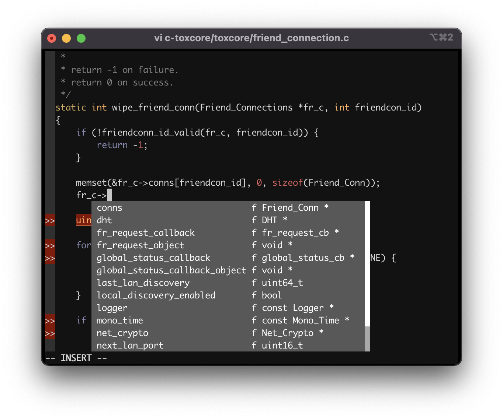

# TokTok stack

This repository contains git submodules for all directly supported Tox-related
repositories. This ensures that any changes made to any of the submodules are
always compatible in the snapshot taken by toktok-stack. Before a toxcore
release, toktok-stack must cleanly build with the latest `master` commit in
`c-toxcore`. Clients, bindings, and support programs must always pass all tests
in this snapshot. We don't guarantee security of the snapshot, merely
interoperability, so don't rely on the security or even error-freeness of
anything here. If you need that, use released versions of the submodules
themselves.

Beyond the clients, bindings, and programs directly maintained and supported by
the TokTok team, here are some additional repositories of interest that develop
their code separately. We hope to integrate some of them into toktok-stack at
some point.

- [aTox](https://github.com/evilcorpltd/aTox) Android Tox client. Developed in a
  fairly rigorous manner and moves slowly but safely. Not as feature-rich as
  other clients, but reliable and secure.
- [rstox](https://github.com/tox-rs/rstox) Rust bindings to c-toxcore.
- [trifa_material](https://github.com/Zoxcore/trifa_material) Experimental
  desktop client using zoxcore (below) written in Kotlin. Works on macOS,
  Windows, and Linux.
- [zoxcore](https://github.com/Zoxcore/c-toxcore) Experimental c-toxcore fork
  with additional toxav (audio/video) development such as x264 video encoding,
  an improved messaging protocol (with stable message IDs). Go here if you want
  to implement your own experimental features in a more fast-paced environment.
  Features here can eventually be merged back into TokTok's toxcore after more
  rigorous testing and review.

## Dev Containers



See [dev containers](tools/built/dev) for details.

## Downloading

To download the TokTok stack, use `git`:

```sh
git clone --recursive https://github.com/TokTok/toktok-stack
```

## Configuring

You may pass a compiler config for additional compiler-specific warnings and
optimisations. If you use Clang (default on OSX), pass `--config=clang`. If you
use GCC, pass `--config=gcc`. On Windows, you don't need any compiler flag
because we assume it's MSVC.

There are also `--config=release` and `--config=debug` and more. See `.bazelrc`
in this repository for more config flags you can pass. If you're using the
Docker build, then `--config=asan`, `tsan`, and `msan` are also available.

We recommend copying `.bazelrc.local.example` to `.bazelrc.local` and
customising it according to the comments in that file.

## Building

After installing prerequisites (instructions below), run the following command
in the `toktok-stack` directory:

```sh
bazel build //...
```

### Installing prerequisites

To build the stack, first you need to install some software. This guide assumes
an installation of Debian GNU/Linux version 9 and that you are in the
`toktok-stack` directory. There is partial support for Mac OS X and FreeBSD, but
not all targets can be built on those systems.

#### Bazel

Install the latest version of
[Bazel](https://github.com/bazelbuild/bazel/releases), e.g.:

```sh
wget https://github.com/bazelbuild/bazel/releases/download/4.2.1/bazel_4.2.1-linux-x86_64.deb
sudo dpkg -i bazel_4.2.1-linux-x86_64.deb
```

On OSX:

```sh
brew install bazel
```

On FreeBSD:

```sh
sudo pkg install bazel
```

On Windows:

```sh
choco install bazel
```

#### Qt5

To build Qt-based binaries such as `qtox`, you need an installation of Qt
development headers and libraries and tools.

```sh
sudo apt install qttools5-dev qttools5-dev-tools libqt5svg5-dev
```

On OSX:

```sh
brew install qt
```

On FreeBSD:

```sh
sudo pkg install qt5
```

On Windows:

```sh
choco install qt
```

If your Qt installation doesn't live in a standard location, make changes to the
detector script in `tools/workspace/qt.bzl` and consider sending us a pull
request. If your version of Qt is different, edit `WORKSPACE` and adjust it in
the `qt_repository` declaration.

#### Extra development packages

Some libraries have not yet been imported into `third_party`, so must be
installed on the system.

For `//qtox`:

```sh
sudo apt install libasound2-dev libxss-dev
```

For `//toxic`:

```sh
sudo apt install libxss-dev
```

On OSX (for both `qtox` and `toxic`):

```sh
brew install ncurses
```

On FreeBSD:

```sh
sudo pkg install ncurses
```

Note that toxic also needs Python 3. See the section on Python for how to
install its development files.

#### Python

To build `py-toxcore-c` and other programs using Python FFI, you need Python
development headers. `py-toxcore-c` and `toxic` both need Python 3. Any of 3.5,
3.6, or 3.7 works.

```sh
sudo apt install python3.5-dev
```

On FreeBSD:

```sh
sudo pkg install python3
```

#### Native javacpp libraries

Streambot needs native libraries that need to be downloaded from Maven.

```sh
wget https://repo1.maven.org/maven2/org/bytedeco/javacpp-presets/ffmpeg/3.4.1-1.4/ffmpeg-3.4.1-1.4-linux-x86_64.jar -O third_party/javacpp/ffmpeg/jar/ffmpeg-3.4.1-1.4-linux-x86_64.jar
wget https://repo1.maven.org/maven2/org/bytedeco/javacpp-presets/opencv/3.4.0-1.4/opencv-3.4.0-1.4-linux-x86_64.jar -O third_party/javacpp/opencv/jar/opencv-3.4.0-1.4-linux-x86_64.jar
```

## Troubleshooting

### Xcode version must be specified to use an Apple CROSSTOOL

Try running the following:

```sh
sudo xcode-select -s /Applications/Xcode.app/Contents/Developer
sudo xcodebuild -license
bazel clean --expunge
```

See
[this](https://github.com/bazelbuild/bazel/issues/4314#issuecomment-370172472)
GitHub comment or [this](https://stackoverflow.com/a/46460129) stackoverflow
answer for more details.
